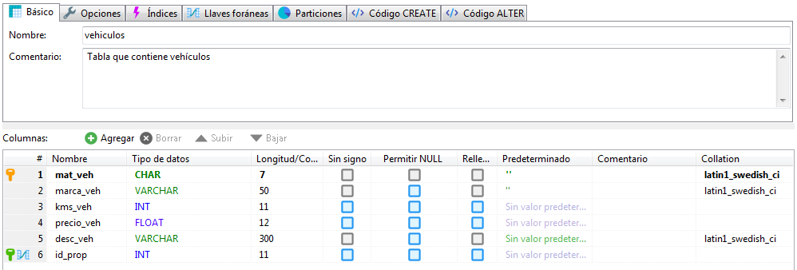
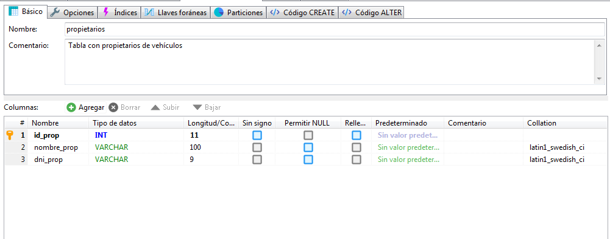

# Detalles de la tarea de esta unidad. Enunciado.

En esta última unidad vamos a implementar una pequeña aplicación que utilice una conexión contra una base de datos relacional, que estará montada sobre MariaDB. Sigue los siguientes pasos:

- Siguiendo los pasos de los contenidos, instala en tu equipo MariaDB y HeidiSQL como aplicación para acceso y administración de bases de datos en MariaDB. Como ya sabes, no importa el SSOO que utilices, hay versiones para los más utilizados.
- Realizada la instalación, inicia el SGBD MariaDB e inicia la aplicación HeidiSQL. Deberás introducir las credenciales de conexión a MariaDB.
- Crea una base de datos desde HeidiSQL denominada Concesionario.
- Dentro de esta base de datos deberás crea dos tablas:
  - Vehículos: almacenará una serie de vehículos.
  - Propietarios: almacenará los propietarios de los vehículos de la tabla anterior.

Observa en las siguientes imágenes la estructura de cada una de las tablas. Observa como en la tabla vehículos, el campo id_prop es una clave externa hacia la tabla propietarios.

El campo id_prop de la tabla Propietarios puede tener un valor auto_incremento.

Utilizando HeidiSQL, inserta datos en ambas tablas que pueden servir para realizar pruebas. Introduce propietarios que pueden tener varios vehículos.

Hasta este punto tenemos la parte de configuración del SGBD. El objetivo desde nuestra aplicación es implementar varias clases que se encargune de realizar la operaciones contra la base de datos. Para ello:

- Crea un nuevo proyecto denominado PROG11_tarea. Configúralo con el driver necesario para acceder al SGBD MariaDB instalado anteriormente.
- Crea un paquete denominado com.prog11.bbdd.
  - Dentro del paquete crea la clase ConnectionDB que se encargue de realizar la conexión contra la base de datos y el cierre de la misma. Para ello implementará los métodos openConnection() y closeConnection().
  - Crea una clase estática denominada PropietariosDAO.java que contenga los métodos necesarios para realizar operaciones contra la tabla propietarios.
    - Insertar un nuevo propietario: Recibe por parámetro los datos de un propietario a insertar, trata de insertarlo en la BBDD y devuelve 0 si la operación se realizó con éxito o -1 en caso contrario.
    - Recuperar vehículos de un propietario: Recibe por parámetro el DNI de un propietario y devuelve una lista con la matrícula, marca, número de kms y precio de todo sus vehículos. Retornará null si hubo problemas.
    - Eliminar propietario: Recibe por parámetro el DNI de un propietario y trata de eliminarlo de la BBDD. Devuelve el número de registros eliminados.
  - Crea una clase estática denominada VehiculosDAO.java que contenga los métodos necesarios para realizar operaciones contra la tabla Vehiculos. Deberá contener métodos para:
    - Insertar un nuevo vehículo: Recibe por parámetro los datos del vehículo a insertar, trata de insertarlo en la BBDD y devuelve 0 si la operación se realizó con éxito o -1 en caso contrario.
    - Actualizar propietario de vehículo: Recibe por parámetro la matrícula de un vehículo junto al identificador de un propietario y trata de actualizar el vehículo en la BBDD. Devuelve 0 si la operación se realizó con éxito o -1 si el vehículo no existe.
    - Eliminar vehículo: Recibe por parámetro la matrícula de un vehículo y trata de eliminarlo de la BBDD. Devuelve 0 si la operación se realizó con éxito o -1 si el vehículo no existe.
    - Recuperar todos los vehículos: No recibe parámetros y devuelve una lista con todos los vehículos del concesionario. Para cada vehículo, la lista contendrá una cadena de caracteres con los datos del mismo, incluido el nombre del propietario.
    - Recuperar vehículos por marca: Recibe una marca por parámetro y devuelve una lista con el listado de vehículos de la citada marca. Para cada vehículo, la lista contendrá una cadena de caracteres con los datos del mismo, incluido el nombre del propietario. Si no existen vehículos, devuelve el ArrayList vacío.
    - Recuperar vehículos: No recibe parámetros (solo la conexión con la BBDD) y retorna una lista con la matrícula, marca, kilómetros y precio de cada vehículo.

Para los métodos que devuelven una lista, ten en cuenta que los elementos de la misma serán cadenas de caracteres.

- Crea otro paquete, denominado com.prog11.princ que contendrá la clase Principal de la aplicación.
  - Dentro este paquete, crea una clase denominada Prog11_Principal.java que contenga el método main.
  - Inserta el código necesario en esta clase para poder probar cada uno de los métodos implementados en las clases de acceso a la BBDD, , siguiendo el siguiente orden
    - Insertar varios vehículos y propietarios.
    - Listar todos los vehículos.
    - Actualizar propietario de un vehículo.
    - Listar todos los vehículos.
    - Eliminar un vehículo que exista.
    - Eliminar un vehículo que no exista.
    - Listar todos los vehículos.
    - Listar los vehículos de una marca.
    - Listar todos los vehículos de un propietario.
    - Eliminar un propietario con vehículos.
    - Eliminar un propietario sin vehículos.

**IMPORTANTE:**

- La conexión se creará en la clase principal y se pasará a los métodos que la necesiten como parámetro.
- Los métodos de las clases DAO no devuelven objetos de tipo ResultSet, deben devolver un arraylist de Strings.
- Las excepciones de los clases que interactúan con la BBDD deben tratarse dentro de la clase.

**Preguntas adicionales:**

- ¿Qué ventajas observas de la separación del código de las clases que acceden a la BBDD de las clases que implementan la lógica de negocio, en este caso, solo la clase principal?
- ¿Se te ocurre alguna propuesta para no tener que crear el objeto Connection en la clase principal?.
- Escribe en un documento pdf tu reflexión.

El alumno puede añadir cualquier funcionalidad adicional que considere oportuna, siempre y cuando suponga añadir funciones a las mínimas propuestas.
